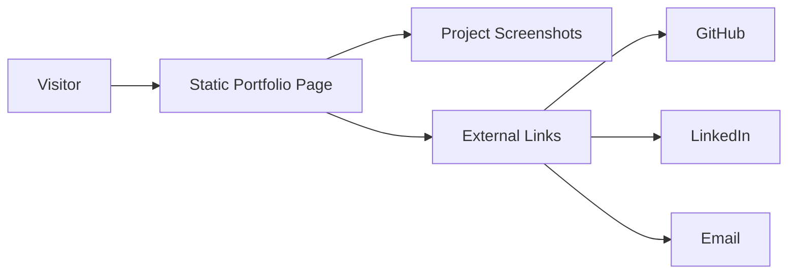

# Sheldon715.github.io - Project Overview

> Personal portfolio website for Sheldon Liu, built as a single-file static site.

## Contents

- [1. Product Summary](#1-product-summary)
- [2. Problem](#2-problem)
- [3. Users and Jobs To Be Done](#3-users-and-jobs-to-be-done)
- [4. Product Scope](#4-product-scope)
- [5. Information Architecture](#5-information-architecture)
- [6. Recommended MVP](#6-recommended-mvp)
- [7. Content Model](#7-content-model)
- [8. System Diagram](#8-system-diagram)
- [9. Link Surface](#9-link-surface)
- [10. UX Notes](#10-ux-notes)
- [11. Build Order](#11-build-order)
- [12. Risks and Open Decisions](#12-risks-and-open-decisions)
- [13. Suggested Repo Structure](#13-suggested-repo-structure)
- [14. Project Links](#14-project-links)

---

## 1. Product Summary

**Sheldon715.github.io** is a personal portfolio site that presents Sheldon Liu, his skills, featured projects, and contact links in a clean, recruiter-friendly format.

### Positioning

This is a lightweight portfolio site, not a web app platform. The goal is to communicate experience quickly and clearly.

### Value proposition

- fast overview of background and stack
- visible project examples with screenshots
- simple access to GitHub, LinkedIn, and email
- easy to keep current

---

## 2. Problem

Potential recruiters and collaborators need a quick way to understand:

- who Sheldon is
- what he builds
- which technologies he uses
- where to view live work and source code

Without a focused portfolio, that information gets scattered across links and repositories.

---

## 3. Users and Jobs To Be Done

| User | Primary job | Success criteria |
|---|---|---|
| Recruiter | Evaluate fit quickly | Finds skills, projects, and contact details fast |
| Hiring manager | Review quality of work | Sees polished visuals and relevant project summaries |
| Collaborator | Reach out easily | Can contact Sheldon without friction |

### Core JTBD statements

- When someone lands on the site, they should understand the profile in seconds.
- When someone reviews projects, they should see real screenshots and live links.
- When someone wants to reach out, contact options should be obvious.

---

## 4. Product Scope

### Core sections

- hero / intro
- about
- projects
- contact

### Core assets

- project screenshots
- external demo links
- GitHub links
- LinkedIn link

### Out of scope

- authentication
- dashboards
- databases
- backend APIs
- content management system

---

## 5. Information Architecture

### Recommended structure

- sticky top navigation
- anchored sections on one page
- project cards with image, summary, stack, and links
- clear contact section at the bottom

### Content rules

- keep copy short
- keep project titles and labels consistent
- keep link targets current
- keep the page easy to scan on mobile

---

## 6. Recommended MVP

## In scope

- responsive one-page layout
- personal introduction
- stack summary
- 3 to 4 featured projects
- contact links
- smooth internal navigation

## MVP success criteria

- the page feels polished on desktop and mobile
- the project gallery loads quickly
- visitors can contact Sheldon without hunting for links

---

## 7. Content Model

### Page sections

- Hero
- About
- Projects
- Contact

### Project entry

Each project needs:

- title
- short description
- screenshot
- tech tags
- live demo link or placeholder
- source link

---

## 8. System Diagram



---

## 9. Link Surface

### Primary links

- GitHub profile
- LinkedIn profile
- email contact

### Project links

- live demo
- source repository

---

## 10. UX Notes

- dark-mode first visual style
- strong hierarchy in the hero
- responsive project grid
- simple hover states
- screenshots should stay readable
- keep the page fast and uncluttered

---

## 11. Build Order

- refresh copy and project descriptions
- keep screenshots current
- add new projects as needed
- split the page into components only if the site grows

---

## 12. Risks and Open Decisions

### Open decisions

1. Whether to keep the site as a single file long term.
2. Whether to add a light theme later.
3. Whether to add more project detail pages.

### Technical risks

- stale project links
- outdated screenshots
- copy drifting away from current experience

---

## 13. Suggested Repo Structure

```text
/
  index.html
  README.md
  assets/
    images/
      *.png
      *.webp
  context/
  docs/
```

---

## 14. Project Links

- GitHub repository
- Live portfolio
- LinkedIn profile
- email contact
